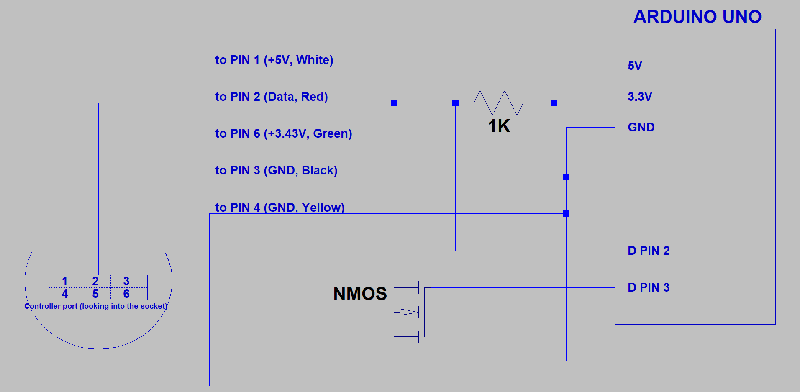
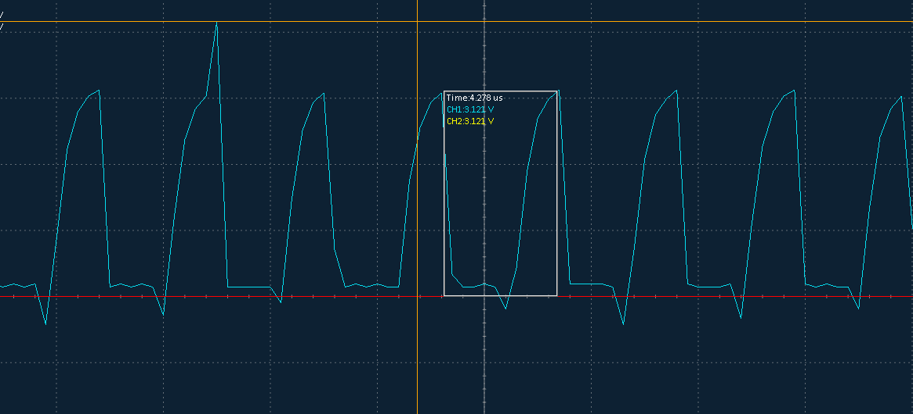
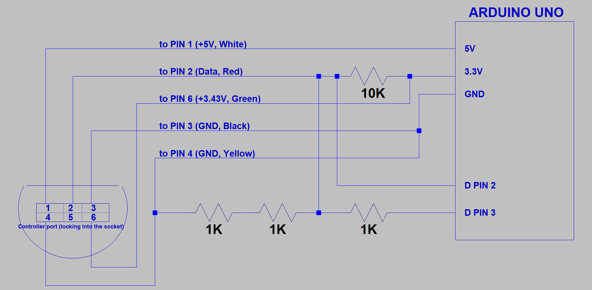
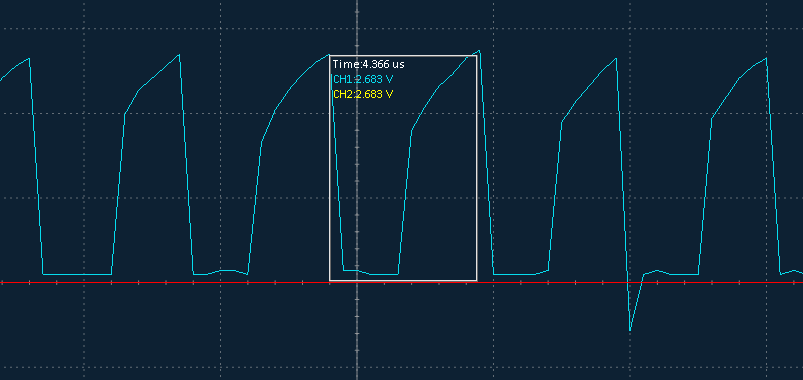
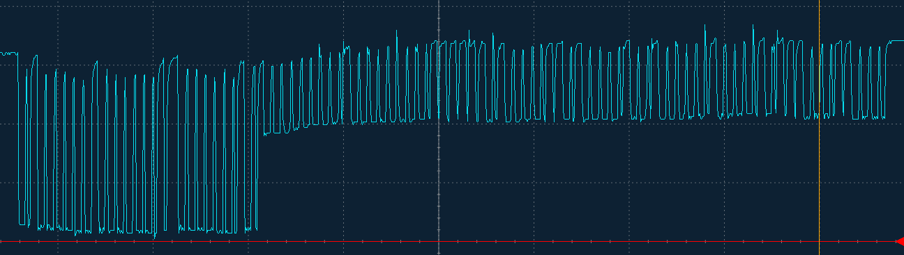
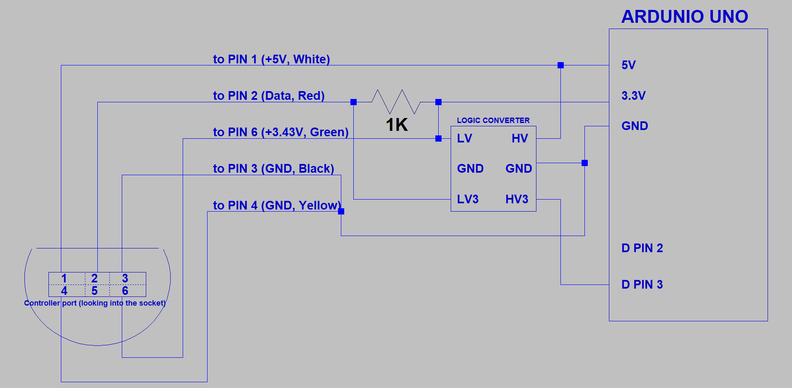

## ***Please note: This is a work in progress and currently has no functionality***
# GameCube Controller Reader
This file will explain in its entirety how this project works
and how it was developed.
<br>
<br>
## Why?
This project was born out of the desire challenge myself
and use an Arduino to do something somewhat practical
that required a lot of technical knowledge to complete.

One day, while I was playing a game with a GameCube controller, the idea popped in my head. 
I thought it would be cool to be able to connect a GameCube controller to an Arduino, which
could then be used for whatever purpose imaginable. Immediately, I got to work.
<br>
<br>
## Resources
After a quick google search, I found 
[this very detailed document from 2004](http://www.int03.co.uk/crema/hardware/gamecube/gc-control.html)
which explains how a GameCube controller is wired and how it sends and receives data.
This document became the primary source of information that I used for this project.

In addition, I consulted various references on Arduinos, especially for the sake of pin configurations.

I am well aware of [NicoHood's Nintendo Library](https://github.com/NicoHood/Nintendo),
which I discovered during the development process. Although I did study the library,
I wanted to do figure out how to do it on my own, so I did not use anything from that project. 
This will be explained more later.
<br>
<br>
## Early stages
I started this project with an [Arduino Starter Kit](https://store.arduino.cc/usa/arduino-starter-kit),
a GameCube controller extention cable, multimeter, wire cutters, and some jumper wires. 
I cut the extention cable, separated and stripped the wires, and hooked it up according to this schematic:



The data line is active high, and is only pulled low to send data. My idea was to use a transistor as a 
digital switch to pull the line low when needed. **This would also avoid the need to step down the voltage
from 5V to 3.3V,** as the transistor would take a 5V signal to the gate, opening the drain to ground.
The multimeter confirmed that the opening and closing the transistor would successfully pull the line
to the desired level.

I then quickly wrote `GC.h` and a program to test it. One challenge was to figure out how to send a store
a byte to then send out. I'm sure I could use 8 8-bit chars, each one storing a 0 or 1, but this approach
seemed irresponsibly wasteful of space, even if the Arduino could handle it. So, I came up with the idea
to use an **array of bools**, since each bool only uses 1 bit. This would make it really easy to access
each bit without taking up too much space. It's worth noting that, although I could hard code the sequence
of sending low, low, high, etc., I wanted to take a more module approach.

I used the Arduino's high level `digitalWrite` and `delayMicroseconds` to send out the 24-bit ping sequence
along with a stop bit, and tried to read the data coming back by using `digitalRead` on PIN 2 every
4&#956;s. I was mostly guessing on the timing for the reading portion. I took the data that was read and
displayed it on the serial monitor.

Of course, this didn't work. The monitor was displaying nothing but 0's. Unfortunately, I had no
idea what was going wrong. The data line was being set in the right order, and the right timing was
being set. I knew then, that I had to dig deeper.
<br>
<br>
<<<<<<< HEAD
## Doing things the hard way
=======
## Timing is Everything, Part I
>>>>>>> 37e61a430ae552d9231836bcbfd33311f0dd8564
The thought popped in my head that, perhaps, the timing on an Arduino is not as exact as I would hope it is.
Of course, every operation it makes has to take some sort of time, but I needed to know how long.

This is when I discovered the sad truth about high level functions: `digitalWrite` takes somewhere in ballpark
of **15&#956;s** to execute. The GameCube controller requires timing to the very microsecond, so this just
wouldn't work at all.

So, instead of using those functions, I decided to directly change and read from the `PORTD` register, which
contains both PIN 2 and 3. However, I still wasn't able to read back any data. Since I still couldn't tell
what was going on, I determed I had to buy an oscilloscope so that I could physically see how the
data line changes over time. I wasn't about to drop $300+ on a good one, though, so I went with a cheaper,
$60 digital scope which I hoped would be suitable for my needs.

Upon hooking up the oscilloscope, I ran the following loop on the Arduino:
```Arduino
void loop() {
  PIND &= ~0x08;
  delayMicroseconds(1);
  PIND |= 0x08;
  delayMicroseconds(3);
}
```
This was meant to constantly send a 1 (1&#956;s low followed by 3&#956;s high). The scope
showed this:



Clearly, something wrong was going on here. Aside from the period being longer than 4&#956;s, The signal
was low longer than it was high, which was absolutely not intended. Adjusting the timing in the program
was not fixing anything. Also, the time it took for the signal to rise to 3V appeared to take longer than
a microsecond, which greatly worried me. I thought it was possible that I wouldn't be able to make this
work with the digital pins on the Arduino. I had to try something else.
<br>
<br>
## Alternate methods of communication
Initially, I wanted to use an existing commuincation standard, specifically UART or I2C.
After quickly deliberating how this might work, it was immediately shut down. UART sends start 
and stop bits after every byte, which would interfere with the sequence. I2C would never work,
since it requires an ongoing "conversation" between the master and slave. In addition, I would need
a voltage converter chip, since this wouldn't work with the transistor circuit above. 
No, this was the completely wrong approach. The GameCube controller uses its own communcation method, 
and no existing standard is going to fit it. I knew at this point I had to manually write to and read
from the data line.

This brings me back to the transistor setup from before. I had the thought that perhaps its physical
properties prevented my signal from being properly transferred, or perhaps was interfering with the
GameCube controller as it was trying to send back data. So, I looked for a different way wire the circuit,
sans transitor.

As I wanted to avoid having to buy components, I tried to find a solution withthe components in the
Arudino kit that I already had. I first came to the optocoupler, which, like the transistor, is a
sort of digital switch. Upon testing it, I realized that the response time is far too slow to
make anything happen. I also thought to use a relay, but as the optocoupler was too slow, surely a 
relay would be, too.

Next, I thought I had a breakthrough. I would use a voltage divider, wired as shown:



Theoretically, this would properly step down the voltage to 3.3V, and would hopefully work
in both directions. I had to change the pull-up resistor to 10k&#8486; to compensate for the
other resistors. Ideally, this would have a near-instant response time. Initial tests seemed promising,
the data line was being pulled low when I wanted it to. Unfortunately, when I plugged in the controller,
the line was being held at around 2V, and couldn't be pulled to ground. Surely, something was going 
on internally with the controller that was causing this to happen, but I don't know what. The important
takeaway, though, was that a voltage divider would not work either. So, I was back to the original setup
with the transistor.
<br>
<br>
<<<<<<< HEAD
## Doing things the hard(er) way
=======
## Timing is Everything, Part II
>>>>>>> 37e61a430ae552d9231836bcbfd33311f0dd8564
With no other ideas, I decided to try to alter the timing between level changes to manipulate the signal
to where it should be. I figured that `delayMicroseconds`, like `digitalWrite`, may not be as accurate
as I hoped it would be. So, I tried to manually make a delay. My idea was to make a loop that adds 1
to a number until a certain value. No matter what I made the maximum value, I was not noticing any
sort of delay on the oscilloscope. My guess is that the compiler makes some sort of optimization that ignores
or speeds up the operation in the loop.

Then, I took a look at the implementation of `delayMicroseconds` and learned of NOP blocks: a sequence of
assembly operations that literally do nothing. So, I decided I would make my own NOP block with the precise
amount of operations needed to get the right delay. I played around with this, trying different amounts but
I was still running into trouble. I couldn't get a period of exactly 4&#956;s without the 1 and 3&#956;s
divisions not being correct.

So, I went to NicoHood's project, and looked at the code for sending the 24-bit sequence. It all made sense,
and I didn't think I was doing anything particularly different, aside from not using assembly. Then, I saw
his schematic, which used a bi-directional logic level converter to step down the 5V from the pins to the
usable 3.3V. This made me realize that I may have been right in thinking that even the transistor I was using
takes too long to change state in order to be usable.

I ordered a logic level converter and a soldering kit and then got to work. After I wired up the circuit to
my new device, I became very confused and worried. Using the same code as above, the oscilloscope showed this:



Two things seemed off here: First, The peaks looked almost more like a sawtooth wave than the desired square
wave. More importantly, the voltage was not peaking at 3.3V. I'm sure a slightly lower peak would be
acceptable, but the ~2.5V on the example was not going to work. It was considerable worse with 
shorter delays. I was confused because, if NicoHood's works like this, then mine should too,
or at least look acceptable. 

My best guess was that the particular chip I had was not fast enough, and I had to buy a better one.
Its also possible that I broke it while soldering it. But, the seller of the particular chip that I 
bought did not have a datasheet to explain anything about timing. So, I purchased a seemingly identical
chip from Sparkfun which claimed to change state in the range of nanoseconds. After it finaly arrived,
I could confirm that it indeed worked far better than the previous chip. I now thought that I finally
had the ticket to success.
<<<<<<< HEAD
<br>
<br>
## One step closer
With my working converter, I started trying to find the right delays between state changes
to send the right information. This mostly took a lot of trial and error with adding or removing
NOPs between operations. To make everything a little more consistant, I tried adding the `volatile`
keyword before the assembly blocks. Also, I disabled interrupts during the process. Finally, I
changed my approach of boolean arrays to normal bytes, checking each individual bit by bitmasking.
Although the boolean array would work, using bytes looks and feels far more professional.

After determining the right timings, I ran the entire sequence, getting the following on the scope:



Almost... something wrong is happening, but the ping seems to be successful. The first, "taller"
part is the data that I sent. Everything after that is the response from the controller. The controller
is supposed to send back 8 bytes of data. If you count the peaks after the sequence, theres 64, which
means this must be the data the controller sent back.

However, there must be a problem with the circuit, since the controller is unable to pull the data
line all the way to low. After trying a few things, I determined the issue was with PIN 3 being held
high while the controller was responding. The solution, then, would be to disable the output pin
immediately after the sequence. An easy way to do this would be to change the pin to an input pin.
This also means, then, that PIN 3 could also be used to read the data coming back, and PIN 2 is no longer
needed. This leaves me with the following final schematic:


=======
>>>>>>> 37e61a430ae552d9231836bcbfd33311f0dd8564
